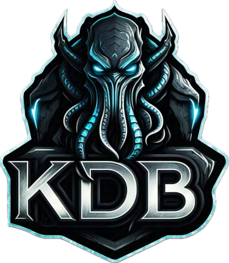

    

---
tiny distributed database

### Introduction
KDB provides a tiny storage engine with the following features:
- single file database storage
- transactional storage framework
- object/file storage framework
- multi-mode storage framework
- security provider framework

### Getting started
You can build KDB using open-source tools: [GCC (C++20)](https://gcc.gnu.org/) / [CMake](https://gitlab.kitware.com/cmake/cmake)

